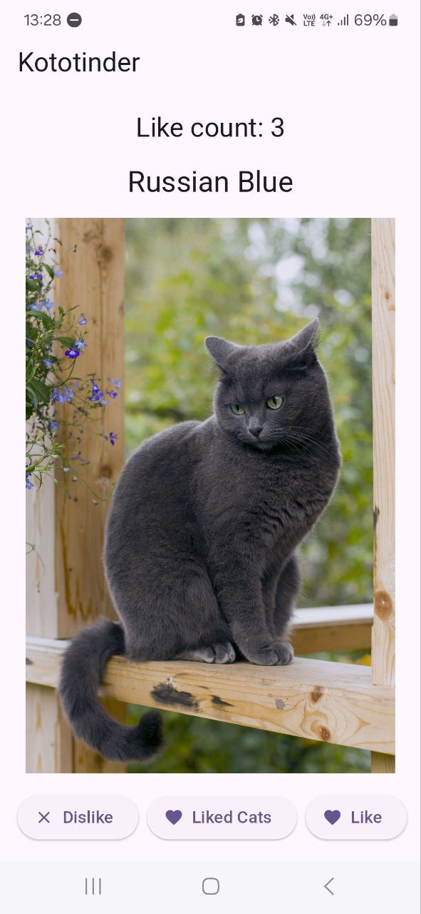
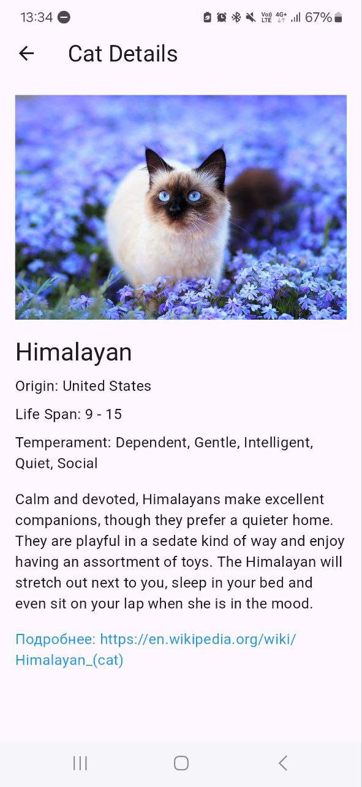
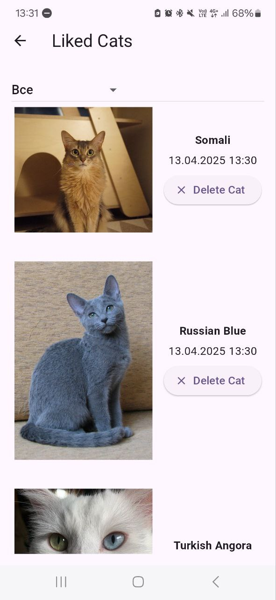
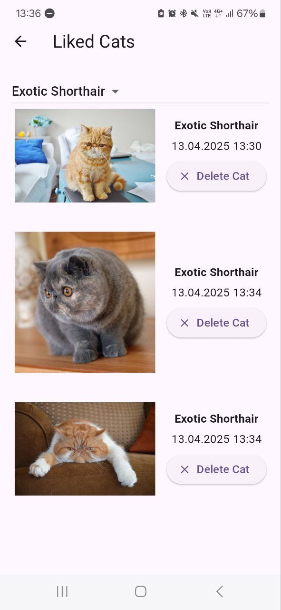

# Кототиндер

Приложение демонстрирует случайные картинки котиков и их породы, получая данные из [The Cat API](https://thecatapi.com/).

## Функциональность

1. На главном экране отображается:
   - Случайное изображение котика
   - Название породы
2. Если свайпать изображение котика влево или нажать кнопку "Dislike", то появиться изображение нового котика.
3. Если свайпать изображение котика вправо или нажать кнопку "Like", то появиться изображение нового котика и счётчик лайков увеличиться на 1.
4. При нажатии на изображение, появляется детальная информация о породе.
5. При нажатии на кнопку "Liked Cats" открывается список лайкнутых котов, который можно отфильтровать по породе, а также удалять из него выбранных питомцев.

   
   
   
   

<h3 style="margin-top: 30px;">
   Ссылка для скачивание apk: <a href = "https://drive.google.com/file/d/1AhNVaNbJOFlqZjOf_rZ4sSrcZjyaXJx2/view?usp=sharing"> https://drive.google.com/file/d/1AhNVaNbJOFlqZjOf_rZ4sSrcZjyaXJx2/view?usp=sharing </a>
   <!-- <a href="">Скачать apk файл</a> -->
</h3>